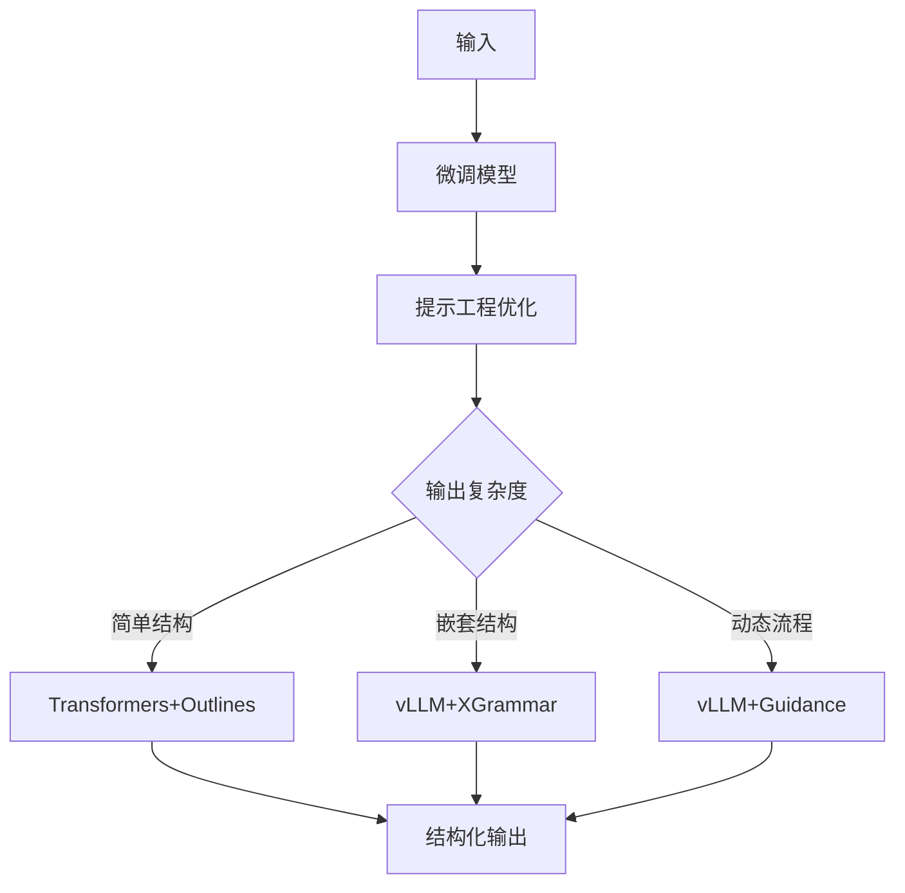
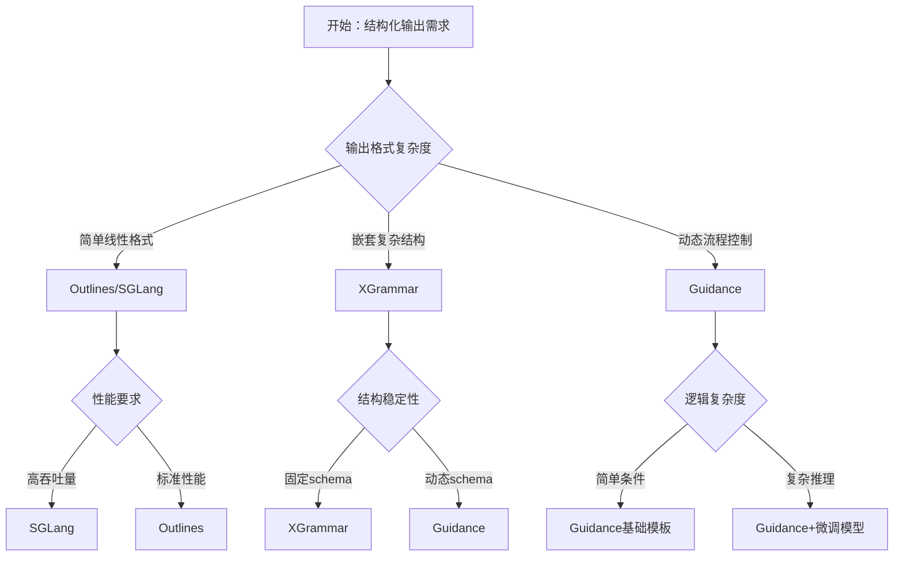

在Agent蓬勃发展的今天，对LLM输出的内容和格式进行有效控制成为必然的课题。通常人们选择让LLM输出结构化格式，如JSON/YAML/SQL等，从而实现与下游系统的有效对接。本文不考虑闭源模型提供的服务，仅介绍在生产环境中自行部署模型推理服务时所使用的结构化输出技术方案。

## 概述：从提示工程到受限解码

在实际工业应用中，确保大语言模型输出结构化数据通常采用混合技术方案：

- **提示工程**：基础引导，成本最低但可靠性有限
- **模型微调**：适配特定领域结构，提升基础能力
- **受限解码**：实时约束生成过程，确保格式合规

生产环境通常组合使用这三种方案：
- 微调模型提供领域知识基础
- 提示工程优化初始引导
- 受限解码保证最终输出格式

---

## 受限解码技术对比

| 技术方案         | 代表框架      | 理论基础                | 约束能力         | 适用场景                | 主要优势                   |
|------------------|---------------|-------------------------|------------------|-------------------------|----------------------------|
| 有限状态机(FSM)  | Outlines      | 正则表达式→状态转移图   | 线性序列规则     | 简单格式：日期/IP/邮箱  | Transformers底层集成方案   |
| 优化FSM          | SGLang        | 压缩状态机与跳跃解码    | 线性序列规则     | 固定格式输出            | 比原生FSM效率提升30%       |
| 上下文无关文法(CFG) | XGrammar    | EBNF语法→下推自动机     | 递归嵌套结构     | JSON/SQL/代码等复杂结构 | CMU团队工业级实现          |
| 模板引擎         | Guidance      | Handlebars模板系统      | 逻辑流控制       | 多步骤推理与条件分支     | 动态逻辑支持能力最佳       |

> 注：推理引擎vLLM支持插拔Outlines/XGrammar/Guidance。Transformers本身不直接实现受限解码，而是通过集成Outlines等库来提供支持。

---

## 生产级混合方案

### 典型架构设计



---

## 具体应用场景示例

### 场景1：客服工单分类系统

**业务需求**：将用户反馈自动分类为工单，包含优先级、类别、标签等字段

**技术方案**：Outlines + 提示工程

```python
from outlines import generate
import re

# 定义工单结构
ticket_schema = {
    "priority": "high|medium|low",
    "category": "technical|billing|feature_request|bug_report",
    "tags": "list[str]",
    "summary": "str"
}

# 使用 Outlines 约束输出
@generate.json(model, schema=ticket_schema)
def classify_ticket(user_feedback: str):
    return f"""
    请将以下用户反馈分类为工单：
    {user_feedback}
    
    输出格式：JSON格式，包含优先级、类别、标签和摘要
    """
```

### 场景2：代码生成与重构

**业务需求**：根据自然语言描述生成特定格式的代码

**技术方案**：XGrammar + 微调模型

```python
from xgrammar import Grammar

# 定义 Python 函数语法
python_function_grammar = Grammar("""
    function ::= "def" identifier "(" parameters ")" ":" newline indent statements
    parameters ::= identifier ("," identifier)*
    statements ::= statement+
    statement ::= assignment | return_statement | if_statement
""")

# 使用 XGrammar 进行代码生成约束
def generate_python_function(description: str):
    return xgrammar.generate(
        model=finetuned_model,
        grammar=python_function_grammar,
        prompt=f"生成Python函数：{description}"
    )
```

### 场景3：多步骤数据分析

**业务需求**：根据用户查询执行复杂的数据分析流程

**技术方案**：Guidance + 模板引擎


```python
import guidance

# 定义分析流程模板
analysis_template = """
{{#system}}
你是一个数据分析专家，请按步骤分析用户需求。
{{/system}}

{{#user}}
{{query}}
{{/user}}

{{#assistant}}
让我分析一下您的需求：

{{#if contains(query, "趋势")}}
1. 首先进行时间序列分析
2. 识别关键趋势点
3. 生成趋势报告
{{else if contains(query, "对比")}}
1. 选择对比维度
2. 计算对比指标
3. 生成对比图表
{{else}}
1. 数据探索性分析
2. 统计描述
3. 可视化展示
{{/if}}

请确认分析方向是否正确？
{{/assistant}}
"""

# 使用 Guidance 进行动态分析
def analyze_data(user_query: str):
    return guidance(analysis_template, llm=model)(query=user_query)
```


---

## 方案选择指南

### 决策流程



---

### 常见问题与解决方案

| 问题 | 原因 | 解决方案 |
|------|------|----------|
| 格式不稳定 | 提示词不够明确 | 使用受限解码约束 |
| 性能瓶颈 | 模型调用频繁 | 引入缓存和批处理 |
| 准确率低 | 缺乏领域数据 | 收集数据并微调模型 |

通过以上策略，可以在保证质量的前提下，快速实现LLM结构化输出的冷启动，并逐步优化到生产级水平。 