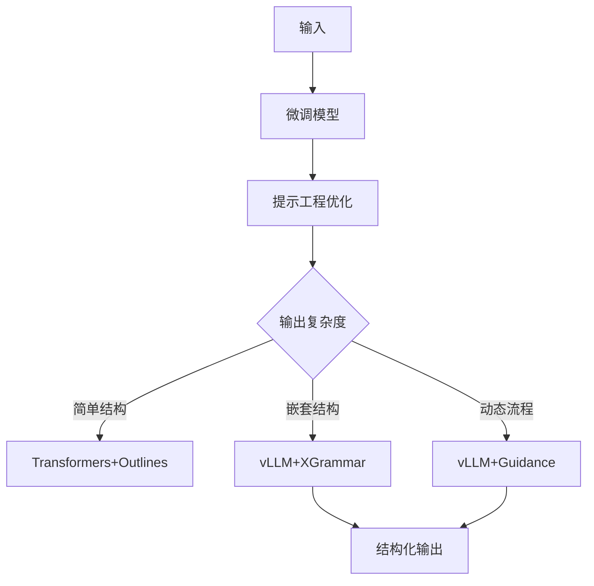
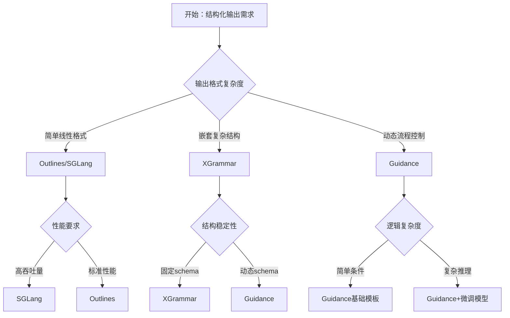

# LLM结构化输出方案介绍

## 概述：从提示工程到受限解码

在实际工业应用中，确保大语言模型输出结构化数据通常采用混合技术方案：

- **提示工程**：基础引导，成本最低但可靠性有限
- **模型微调**：适配特定领域结构，提升基础能力
- **受限解码**：实时约束生成过程，确保格式合规

生产环境通常组合使用这三种方案：
- 微调模型提供领域知识基础
- 提示工程优化初始引导
- 受限解码保证最终输出格式

---

## 受限解码技术对比

| 技术方案         | 代表框架      | 理论基础                | 约束能力         | 适用场景                | 主要优势                   |
|------------------|---------------|-------------------------|------------------|-------------------------|----------------------------|
| 有限状态机(FSM)  | Outlines      | 正则表达式→状态转移图   | 线性序列规则     | 简单格式：日期/IP/邮箱  | Transformers底层集成方案   |
| 优化FSM          | SGLang        | 压缩状态机+跳跃解码      | 线性序列规则     | 固定格式输出            | 比原生FSM效率提升30%       |
| 上下文无关文法(CFG) | XGrammar    | EBNF语法→下推自动机     | 递归嵌套结构     | JSON/SQL/代码等复杂结构 | CMU团队工业级实现          |
| 模板引擎         | Guidance      | Handlebars模板           | 逻辑流控制       | 多步骤推理、条件分支     | 动态逻辑支持最佳           |

> 注：推理引擎 vLLM 可插拔 Outlines/XGrammar/Guidance。Transformers 本身不直接实现受限解码，而是通过集成 Outlines 等库提供支持。

---

## 生产级混合方案

### 典型架构组合



---

## 具体应用场景示例

### 场景1：客服工单分类系统

**需求**：将用户反馈自动分类为工单，包含优先级、类别、标签等字段

**推荐方案**：Outlines + 提示工程

```python
from outlines import generate
import re

# 定义工单结构
ticket_schema = {
    "priority": "high|medium|low",
    "category": "technical|billing|feature_request|bug_report",
    "tags": "list[str]",
    "summary": "str"
}

# 使用 Outlines 约束输出
@generate.json(model, schema=ticket_schema)
def classify_ticket(user_feedback: str):
    return f"""
    请将以下用户反馈分类为工单：
    {user_feedback}
    
    输出格式：JSON格式，包含优先级、类别、标签和摘要
    """
```

### 场景2：代码生成与重构

**需求**：根据自然语言描述生成特定格式的代码

**推荐方案**：XGrammar + 微调模型

```python
from xgrammar import Grammar

# 定义 Python 函数语法
python_function_grammar = Grammar("""
    function ::= "def" identifier "(" parameters ")" ":" newline indent statements
    parameters ::= identifier ("," identifier)*
    statements ::= statement+
    statement ::= assignment | return_statement | if_statement
""")

# 使用 XGrammar 约束代码生成
def generate_python_function(description: str):
    return xgrammar.generate(
        model=finetuned_model,
        grammar=python_function_grammar,
        prompt=f"生成Python函数：{description}"
    )
```

### 场景3：多步骤数据分析

**需求**：根据用户查询执行复杂的数据分析流程

**推荐方案**：Guidance + 模板引擎

```python
import guidance

# 定义分析流程模板
analysis_template = """
{{#system}}
你是一个数据分析专家，请按步骤分析用户需求。
{{/system}}

{{#user}}
{{query}}
{{/user}}

{{#assistant}}
让我分析一下您的需求：

{{#if contains(query, "趋势")}}
1. 首先进行时间序列分析
2. 识别关键趋势点
3. 生成趋势报告
{{else if contains(query, "对比")}}
1. 选择对比维度
2. 计算对比指标
3. 生成对比图表
{{else}}
1. 数据探索性分析
2. 统计描述
3. 可视化展示
{{/if}}

请确认分析方向是否正确？
{{/assistant}}
"""

# 使用 Guidance 执行动态分析
def analyze_data(user_query: str):
    return guidance(analysis_template, llm=model)(query=user_query)
```

---

## 方案选择指南

### 决策树



---


### 常见陷阱与解决方案

| 问题 | 原因 | 解决方案 |
|------|------|----------|
| 格式不稳定 | 提示词不够明确 | 使用受限解码约束 |
| 性能瓶颈 | 模型调用频繁 | 引入缓存和批处理 |
| 准确率低 | 缺乏领域数据 | 收集数据并微调模型 |

通过以上策略，可以在保证质量的前提下，快速实现LLM结构化输出的冷启动，并逐步优化到生产级水平。

